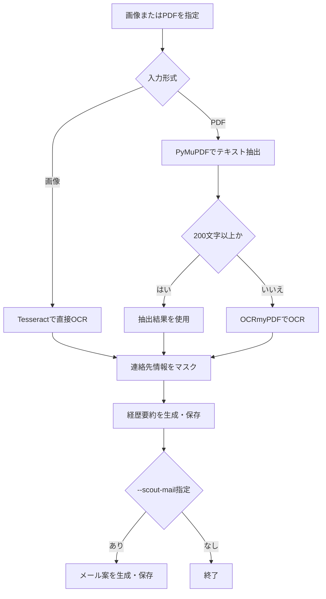

# レジュメ要約ツール

ShareXのスクロールキャプチャ画像やPDFから候補者情報を読み取り、個人情報をマスクしたうえでOpenAI APIに渡し、経歴要約とスカウトメール案の作成までを支援するツールです。

## 概要

採用担当者がスカウトや書類確認のたびに行っている「候補者情報の確認 → 経歴の要約 → スカウト文面の作成」という一連の作業を、手作業からツールによる支援に置き換えることを目的として作成しました。
ShareXでキャプチャした画像やPDFを入力として渡すだけで、OCR・個人情報マスク・経歴要約・スカウトメール案の作成までを一括、または段階的に実行できます。

## 解決したい課題

採用業務では、以下のような作業に日常的に時間がかかります。

- 候補者情報（職務経歴書・レジュメ）をスクリーンショットやPDFで受け取り、内容を都度読み込んで確認する
- 候補者ごとに経歴を要約し、選考メモやスカウト判断のための材料を作る
- 候補者ごとにスカウトメール文面を一から作成する
- 生成AIを使いたいが、メールアドレスや電話番号などの個人情報をそのまま外部APIに渡すことへの懸念がある

これらは定型化しやすい作業でありながら、担当者の手作業に依存しているため、候補者数が増えるほど負荷が大きくなります。

## 想定利用シーン

- スカウト媒体で、候補者のレジュメをスクロールキャプチャで確認したとき
- 候補者情報を受け取った直後に、要点を素早く把握したいとき
- 複数の候補者に対して、似た内容のスカウトメールを効率よく作成したいとき
- 個人情報を含むデータを、社内ルールに沿って安全に生成AIへ渡したいとき

## このツールでできること

- 画像（PNG / JPG）またはPDFから候補者情報を抽出（入力形式は自動判定）
- 個人情報（メールアドレス・電話番号・郵便番号・住所など）をマスクしたうえで生成AIに送信
- 候補者の経歴要約を生成
- スカウトメール案を生成
- 処理時間をログ出力し、どの工程に時間がかかっているかを確認
- クリップボードコピー・テキスト保存に対応し、実務でそのまま使いやすくする

## 業務改善ポイント

- 手作業での経歴確認・要約作業を削減し、候補者情報の把握にかかる時間を短縮する
- 候補者情報の確認からスカウト文面作成までの一連の流れを、ツール実行1回にまとめる
- OpenAI APIへ送信する前に個人情報をマスクする工程を挟むことで、生成AI利用時の情報漏えいリスクを下げる
- 処理時間ログにより、OCR・要約・メール生成のどこに時間がかかっているかを可視化し、改善余地を確認できる
- 大掛かりなシステム導入ではなく、既存の採用業務フローに組み込める小さなDX・業務効率化の実例として作成している

## 改善効果

- スカウトメッセージの下書き作成にかかる時間は、手作業では一例として約10分程度だったものが、生成AIの活用により約1分程度まで短縮できる見込みがある（利用環境や入力データによって変動するため、あくまで目安）
- 候補者情報の確認・要約・スカウト文面作成までを一連の流れで支援することで、初期確認作業の負荷軽減を狙っている
- 処理時間ログにより、OCR・要約生成・スカウトメッセージ生成のどこに時間がかかっているかを確認でき、継続的な改善につなげられる

## 処理フロー



## 技術構成

- Python 3.11.9（動作確認環境）
- OpenAI API / ローカルLLM（Ollama等） / OrcaRouter（経歴要約・スカウトメール生成。`LLM_PROVIDER` で切り替え）
- Tesseract OCR（画像および日本語OCR）
- ocrmypdf（PDFへのOCR適用）
- Ghostscript（ocrmypdfが内部で使用。Windowsでは手動インストールが必要）
- ShareX（スクロールキャプチャ・After capture tasksからの自動実行）
- PowerShell（セットアップ・実行スクリプト）
- PDF / 画像 / テキスト処理
- 正規表現による個人情報マスク処理（メールアドレス・電話番号・郵便番号・住所など）

## 実行例

### 通常の一括実行（ocr.py）

ShareXでキャプチャした画像（またはOCR前のPDF）から、OCR・要約・クリップボードコピーまでを一括で行います。

```powershell
python ocr.py "画像またはPDFのパス" --copy
```

主なオプション:
- `--copy`: 要約結果をクリップボードにもコピー
- `--save <path>`: 要約結果の保存先を指定（未指定時はOCR後のPDFと同じ場所）
- `--model <name>`: 使用するモデル名（未指定時は選択中プロバイダーの `<PROVIDER>_MODEL` 環境変数を使用）
- `--language <lang>`: ocrmypdfに渡すOCR言語（既定: jpn）
- `--keep-intermediate`: 中間生成物のPDFを残す
- `--min-text-chars <n>`: PDFテキスト抽出で十分とみなす最小文字数（既定: 200）

すでにOCR済みのPDFがあり、要約のみ行いたい場合は `summarize_resume.py` を直接使用できます。

```powershell
python summarize_resume.py "OCR済みPDFパス" --copy
```

OCR済みPDFの要約だけを `run.ps1` で実行する場合:

```powershell
.\run.ps1 "OCR済みPDFパス"
.\run.ps1 "OCR済みPDFパス" -Model gpt-4.1-mini
.\run.ps1 "OCR済みPDFパス" -Save result.txt
.\run.ps1 "OCR済みPDFパス" -Copy
```

`main.py` がある構成では `run.ps1` が `main.py` を実行します。このリポジトリの現在の構成では、互換のため `summarize_resume.py` を実行します。

### スカウトメール生成

ShareX のキャプチャー結果から OCR、要約、スカウトメール生成まで一括実行する場合:

```powershell
python ocr.py "画像またはPDFパス" --scout-mail --copy-mail --company-name "株式会社サンプル"
```

主なオプション:
- `--scout-mail`: 要約に加えてスカウトメール案を生成
- `--copy-mail`: 生成したスカウトメール案をクリップボードにコピー
- `--company-name <name>`: スカウトメールに記載する自社名

`ocr.py` は入力拡張子を自動判定します。PNG/JPGなどの画像はPDF化せず直接OCRし、PDFは先にテキスト抽出を試して、抽出文字数が少ない場合のみOCRします。
既定では200文字未満の場合にOCRへフォールバックします。必要に応じて `--min-text-chars 300` のように調整できます。

既存の要約テキストからスカウトメールだけを作る場合:

```powershell
python scout_mail.py "要約テキストパス" --copy --company-name "株式会社サンプル"
```

OCR済みPDFを直接渡すこともできます。この場合は、PDFから候補者要約を生成してからスカウトメールを作成します。

```powershell
python scout_mail.py "OCR済みPDFパス" --copy --company-name "株式会社サンプル"
```

スカウトメール生成は、現状の手動作成運用に合わせてスカウト媒体向けを既定にしています。既定では、候補者アクションは `気になる`、募集ポジションは `営業職など`、希望勤務地は `任意の勤務地` として扱い、文面で触れる勤務地は任意に指定可能です。

必要に応じて以下のように上書きできます。

```powershell
python scout_mail.py "要約テキストパス" --copy --candidate-action "いいね" --desired-roles "営業" --desired-locations "東京" --work-location "東京"
```

求人情報を長めに渡したい場合は、テキストファイルを用意して `--job-context-file "C:\path\job_context.txt"` を追加してください。

## セットアップ（Windows PowerShell前提）

このREADMEのコマンド例は Windows 11 の PowerShell を前提にしています。
本READMEのコマンドは、Windowsの「PowerShell」で実行します。
スタートメニューから「PowerShell」と検索して起動してください。

※wingetによるインストールは、環境によっては管理者権限が必要になる場合があります
（エラーが出る場合は、PowerShellを管理者として実行してください）

### 初回セットアップ（setup.ps1）

Python 3.11.9 を想定しています。未インストールの場合は先に導入してください。

```powershell
winget install --id Python.Python.3.11.9 -e
python --version
```

依存関係のインストールと仮想環境作成は `setup.ps1` でまとめて実行できます。

```powershell
.\setup.ps1
```

`setup.ps1` は次を行います。
- Python の存在確認
- `.venv` の作成
- `requirements.txt` のインストール
- `.env.example` がある場合の案内

### 1. 必要なソフトウェアのインストール

`setup.ps1` を使わない場合は、Python・ShareX・Tesseract OCR（日本語OCRエンジン）をまとめてインストールします。

```powershell
winget install --id Python.Python.3.11.9 -e
winget install --id ShareX.ShareX -e
winget install --id UB-Mannheim.TesseractOCR -e

# インストールしたPythonのバージョン確認
python --version
```

### 2. Ghostscriptのインストール（ocrmypdf に必要）

ocrmypdf はPDF処理のためにGhostscriptを利用します。Ghostscriptはwinget等でのサイレントインストールに対応していないため、公式サイトから手動でインストールしてください。

1. [Ghostscriptダウンロードページ](https://ghostscript.com/releases/gsdnld.html)からWindows 64-bit版のインストーラーをダウンロード
2. インストーラーを実行し、既定のオプションでインストール
3. 新しいPowerShellを開き、認識されているか確認

```powershell
gswin64c --version
```

ocrmypdfはWindowsレジストリや`Program Files`の標準インストール先を自動的に検出するため、通常はPATHへの追加は不要です。`gswin64c`が見つからない場合のみ、インストール先（例: `C:\Program Files\gs\gs10.xx.x\bin`）をPATH環境変数に追加してください。

Ghostscriptが未インストールの状態で`ocr.py`のPDF OCR処理を実行すると、`ocrmypdf`がエラーで停止します。

### 3. 日本語OCRデータの配置

Tesseractの日本語モデルをダウンロードし、`tessdata`フォルダに配置します。

```powershell
Invoke-WebRequest -Uri "https://raw.githubusercontent.com/tesseract-ocr/tessdata/main/jpn.traineddata" -OutFile "$Env:ProgramFiles\Tesseract-OCR\tessdata\jpn.traineddata"
```

うまくいかない場合は、[配布元ページ](https://github.com/tesseract-ocr/tessdata/blob/main/jpn.traineddata)から手動でダウンロードし、`C:\Program Files\Tesseract-OCR\tessdata\` に置いてください。

### 4. 利用するLLMプロバイダーの設定

本ツールは `LLM_PROVIDER` 環境変数で、経歴要約・スカウトメール生成に使うAPIを切り替えられます。

- `openai`: OpenAI API（既定）
- `local`: ローカルLLM（Ollama など、OpenAI互換の Chat Completions エンドポイントを公開しているもの）
- `orcarouter`: OrcaRouter（OpenAI互換の外部ルーティングサービス）

設定は `.env.example` をコピーして `.env` を作成し、値を編集する方法を推奨します（`.env` はGit管理対象外です）。

```powershell
Copy-Item .env.example .env
```

`.env` の内容:

```
# 使用するプロバイダー: openai / local / orcarouter
LLM_PROVIDER=openai

# OpenAI
OPENAI_API_KEY=
OPENAI_MODEL=

# ローカルLLM（Ollama）
LOCAL_LLM_BASE_URL=http://localhost:11434/v1
LOCAL_LLM_API_KEY=ollama
LOCAL_LLM_MODEL=

# OrcaRouter
ORCAROUTER_API_KEY=
ORCAROUTER_BASE_URL=https://api.orcarouter.ai/v1
ORCAROUTER_MODEL=orcarouter/auto
```

- `OPENAI_API_KEY` は[こちら](https://platform.openai.com/login?next=%2Fapi-keys)で発行できます。
- `local` を使う場合は、事前にOllama等でOpenAI互換エンドポイント（既定: `http://localhost:11434/v1`）を起動しておいてください。`LOCAL_LLM_API_KEY` はSDK初期化に必要なダミー値で、秘密情報ではありません。
- `OPENAI_MODEL` / `LOCAL_LLM_MODEL` は未設定だとエラーになります。使用するモデル名を必ず設定するか、実行時に `--model` オプションで指定してください（`ORCAROUTER_MODEL` のみ既定値 `orcarouter/auto` があります）。

`.env` を使わず、OSの環境変数に直接設定することもできます。

```powershell
setx OPENAI_API_KEY "your_api_key_here"

# 設定した環境変数の確認 ※setx実行後は、新しいPowerShellを開いて実行してください
echo $Env:OPENAI_API_KEY
```

macOS / Linuxの場合:
```bash
export OPENAI_API_KEY="sk-..."
```

### 5. リポジトリの取得

Gitを利用できる場合は、以下で取得してください。

```powershell
git clone https://github.com/Takayuki-Isrg/summarize_resume.git
cd summarize_resume
```

Gitを使わない場合は、[ZIPファイル](https://github.com/Takayuki-Isrg/summarize_resume/archive/refs/heads/main.zip)をダウンロードして任意の場所に解凍し、`summarize_resume`フォルダに移動してください。

### 6. 仮想環境の作成と依存関係のインストール

`setup.ps1` を使わない場合は、手動で仮想環境を作成します。

```powershell
python -m venv .venv
.venv\Scripts\activate
pip install -r requirements.txt
```

VS Codeで `pip install` 後も `import` 警告が残る場合は、VS Codeが古いPython環境情報を保持している可能性があります。
仮想環境が選択されていることを確認し、VS Codeを再起動してください。

## ShareX Actions 設定例

ShareX の `タスクの設定 > アクション` に外部アクションを追加し、After capture tasks で `Save image to file` と `Perform actions` を有効にします。

- File path: `C:\Python\summarize_resume\.venv\Scripts\python.exe`
- Arguments:

```text
"C:\Python\summarize_resume\ocr.py" "$input" --scout-mail --copy-mail --company-name "株式会社サンプル"
```

求人情報を長めに渡したい場合は、テキストファイルを用意して `--job-context-file "C:\path\job_context.txt"` を追加してください。

## 精度に関する注意

OCRおよび要約精度は、入力となるPDFの形式に依存します。
特に以下のケースでは精度が低下することがあります：

- スカウト媒体のレジュメPDF（レイアウトの影響）
- 画像品質が低いキャプチャ

要約結果は必ず人手で確認する前提としてください。

本ツールでは OCR に Tesseract OCR と ocrmypdf を使用します。画像入力は Tesseract OCR で直接テキスト化し、PDF入力でOCRが必要な場合は ocrmypdf を使用します。
事前に以下をインストールしてください。

- Tesseract OCR（セットアップ手順 1 でインストール）
- Ghostscript（セットアップ手順 2 でインストール。ocrmypdf が内部で使用）
- ocrmypdf（`requirements.txt` に含まれます）
- jpn.traineddata（セットアップ手順 3 で配置）

## セキュリティ・個人情報に関する注意

- APIキーはリポジトリに含めない
- 実在候補者のPDF、画像、要約結果、スカウト文面はコミットしない
- OpenAI APIへ送信する前に、メールアドレス・電話番号・郵便番号・住所などの個人情報をマスクする
- 個人情報マスクはリスク低減を目的とした補助的な機能であり、完全な匿名化を保証するものではない
- 実運用では、マスク処理後も外部APIに送信する内容を事前に確認する
- 生成AIの出力（要約・スカウト文面）は、実務で使用する前に必ず人間が内容を確認する
- 採用活動で利用する場合は、社内ルール・法務・コンプライアンス・個人情報保護方針に従って運用する
- PowerShellで `.ps1` の実行がブロックされる場合は、実行ポリシーを確認する

## 処理時間ログ

処理時間は `sharex_resume.log` に出力されます。前処理が遅い場合は、まず `PDFテキスト抽出`、`画像OCR`、`PDF OCR`、`経歴要約生成`、`スカウトメール生成` の秒数を確認してください。

ログ出力例:

```text
2026-04-28 18:00:00 [INFO] 処理時間: 入力判定 0.00秒
2026-04-28 18:00:04 [INFO] 処理時間: 画像OCR 3.85秒
2026-04-28 18:00:04 [INFO] 処理時間: 前処理 3.86秒
2026-04-28 18:00:14 [INFO] 処理時間: 経歴要約生成 9.72秒
2026-04-28 18:00:24 [INFO] 処理時間: スカウトメール生成 10.11秒
2026-04-28 18:00:24 [INFO] 処理時間: 全体 24.20秒
```

## 今後の改善予定

現在はレジュメ要約とスカウトメッセージ案の作成を一連の流れで行えます。
今後は、求人票ごとのプロンプト切り替えや、スカウト文面のA/Bパターン生成などを検討します。

なお、実際の送信前には、候補者情報・求人内容・法務/コンプライアンス観点を人手で確認してください。

## 変更履歴

### 2026-08-23
- README: Ghostscriptのインストール手順（セットアップ手順2）を追記。ocrmypdfが依存しているにもかかわらず記載が無く、環境構築時に気づきにくかったため。winget等でのサイレントインストールに対応していないため、手動インストール手順として明記。
- `llm_provider.py` を新設し、`LLM_PROVIDER` 環境変数で OpenAI API / ローカルLLM（Ollama等） / OrcaRouter を切り替えられるようにした。
- `.env.example` を追加。`python-dotenv` により `.env` を自動読み込みするようにした（`.env` は既存どおりGit管理対象外）。
- `summarize_resume.py` / `scout_mail.py` / `summary_with_sources.py` / `ocr.py` の OpenAI クライアント生成・API呼び出しを `llm_provider.py` 経由に統一。OpenAIプロバイダーは既存の Responses API を維持し、ローカルLLM / OrcaRouter は OpenAI互換の Chat Completions を使用する。
- モデル名の暗黙のデフォルト（`gpt-4.1-mini`固定）を廃止。`--model` 未指定時は `<PROVIDER>_MODEL` 環境変数を使用し、未設定ならエラーで明示するように変更（`orcarouter` のみ既定値 `orcarouter/auto` を維持）。
- `tests/test_llm_provider.py` を追加（`pytest`、`requirements-dev.txt`）。

### 2026-07-10
- README: 実行手順を実態に合わせて修正（`ocr.py` による一括実行を主な手順として明記）。セットアップ手順を再構成して簡素化。
- `requirements.txt`: プロジェクトで実際に使用していない依存関係（nipype, nibabel, pyxnat, scipy, pandas など）を削除し、実際に使用するパッケージのみに整理。
- `summary_with_sources.py`: テキスト抽出後に個人情報マスク処理（`sanitize_text`）を適用するよう修正。
  修正前は、メールアドレス・電話番号・郵便番号・住所がマスクされないまま OpenAI API に送信されていた。
